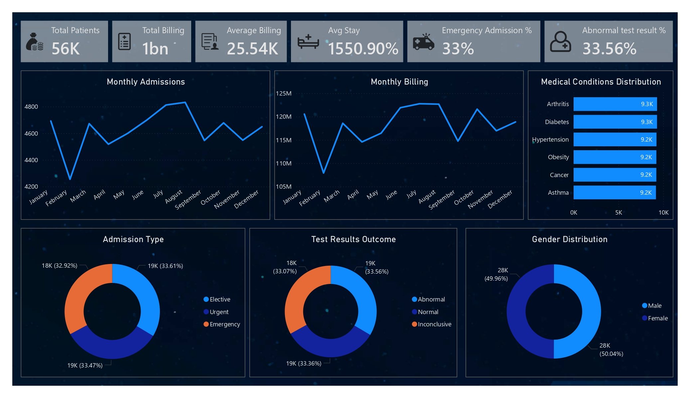

# Healthcare Data Analytics Project
## Project Objective
This project focuses on analyzing a Healthcare Dataset containing 55,500 patient records to uncover insights related to medical conditions, hospital admissions, billing patterns, and patient demographics. 

## Dashboard

## Dataset used
Total Records: 55,500 
<a href="healthcare_dataset_clean.csv" target="_blank">healthcare_dataset_clean.csv</a>  
Columns Included: 
1. Name 
2. Age 
3. Gender 
4. Blood Type 
5. Medical Condition 
6. Date of Admission 
7. Doctor 
8. Hospital 
9. Insurance Provider 
10. Billing Amount 
11. Room Number 
12. Admission Type 
13. Discharge Date 
14. Medication 
15. Test Results 

## Business Questions Solved
<a href="healthcare_dataset.pdf" target="_blank">healthcare_dashboard.pdf</a>   
This project answers several healthcare analytics questions: 
1. What are the most common medical conditions among patients? 
2. Which admission type occurs most frequently? 
3. What is the average billing cost per patient? 
4. How does patient age distribution look? 
5. Which hospitals handle the most patients? 
6. What percentage of test results are normal vs abnormal? 

## Process
This project demonstrates the following data analytics skills: 
1. Data Cleaning 
2. Data Transformation 
3. SQL Query Writing 
4. Data Visualization 
5. Business Insight Generation 
6. Dashboard Design 
7. End-to-End Data Analytics Workflow 

## Project Insight
The specific focus of this healthcare data analytics project is the analysis of the provided dataset on patient records in order to identify meaningful patterns and trends in terms of patient demographics, medical conditions, hospital admissions, and billing amounts. First and foremost, the dataset was arranged and cleaned in Microsoft Excel in order to ensure the accuracy and consistency of the data. Once the data was properly cleaned and arranged, the dataset was then imported into the PostgreSQL database management system through the use of the pgAdmin tool. Lastly, the Power BI tool was utilized in the creation of an interactive dashboard in order to present the identified trends and insights in a more understandable manner. Overall, this healthcare data analytics project presents the raw data and its transformation into meaningful insights through the entire data analytics lifecycle.

## Final Conclusion
Overall, this project demonstrates the value and necessity of data analytics in the healthcare industry by transforming raw data about patients into useful information that can be used to make informed decisions. This was achieved through the application of Excel, PostgreSQL, and Power BI tools, which identified trends in the demographics of patients, common medical conditions, and hospital admissions. The Power BI tool is instrumental in helping to communicate these findings in an easily understandable format, which can be beneficial to the healthcare industry as it can be used to improve hospital operations and patient care. This project is an example of an end-to-end data analytics project that can be used in the real world and is beneficial because it shows the application and usage of data cleaning, SQL, and visualization skills.

